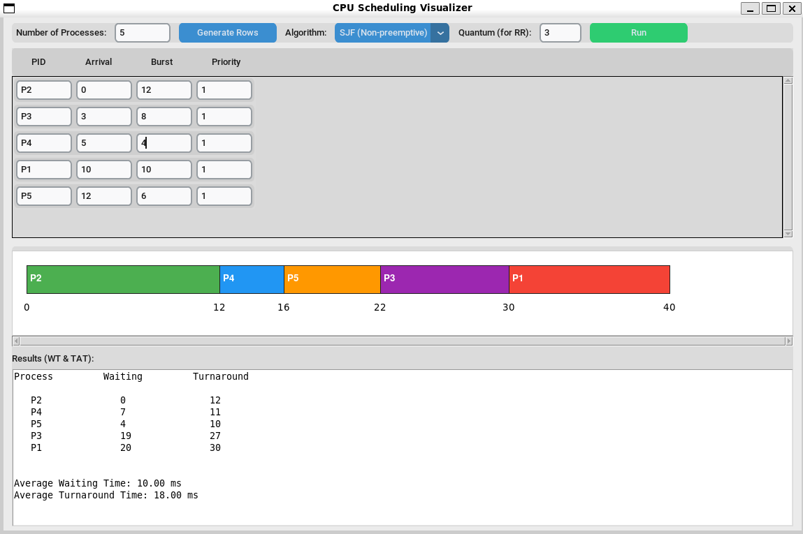

# CPU Scheduling Simulator (Python + CustomTkinter)

This project is a **CPU Scheduling Simulator** built using **Python** and **CustomTkinter**. It allows the user to input processes and simulate different CPU scheduling algorithms using an interactive graphical interface.

---

## 📌 Features
- Graphical User Interface (GUI) using **CustomTkinter**
- Dynamic table for entering processes (PID, Arrival Time, Burst Time, Priority)
- Supports multiple CPU scheduling algorithms (depending on your implementation):
  - FCFS (First Come First Served)
  - SJF (Shortest Job First)
  - Priority Scheduling
  - Round Robin
  - Preemptive / Non-Preemptive modes (if included)
- Automatically generates:
  - **Gantt Chart**
  - **Waiting Time**
  - **Turnaround Time**
  - **Average WT / TAT**
- Clean layout with labels aligned directly above input columns

---

## 🧩 How It Works
1. Enter the number of processes.
2. A dynamic table is generated.
3. Fill in:
   - **PID**
   - **Arrival Time**
   - **Burst Time**
   - **Priority** (if used)
4. Select the scheduling algorithm.
5. Click **Run** to generate results.

   - Process execution order
   - Calculated metrics
   - Gantt chart timeline

---


## 🛠️ Installation
### 1. Clone the repository
```bash
git clone https://github.com/K-a-r-e-e-m/CPU-scheduling-visualizer.git
```
```
cd CPU-scheduling-visualizer
```


### 2. Install required packages

```bash
pip install customtkinter
```

---

## 🚀 Run the Program
```bash
python main.py
```

---

## 📷 Screenshots


---

## 👤 Author
**Kareem Hany Abdelkader**
